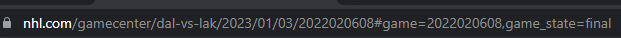

# Hockey Game Prediction Tool

This is a hockey score predictor application which can be used on any past or live NHL game to predict its final score.
It uses machine learning to analyse play-by-play for a current game and predict its final score.

## How to run

Simply go to root folder and run:
```
docker-compose up
```

To close it simply do `ctrl+c` on the terminal or open another terminal and type:
```
docker-compose down
```
Open `localhost:8892` or `0.0.0.0:8892` in any browser.

## How to use

On the Steamlit browser application, simply choose a model, find any past or even live game and predict its score!
To find a game ID, simply go to NHL website, find any game you like and find its game ID in the address bar like so:



Use the number after the date, in this example we would use `2022020608`.

Enter this number and press predict!

### Enjoy!

